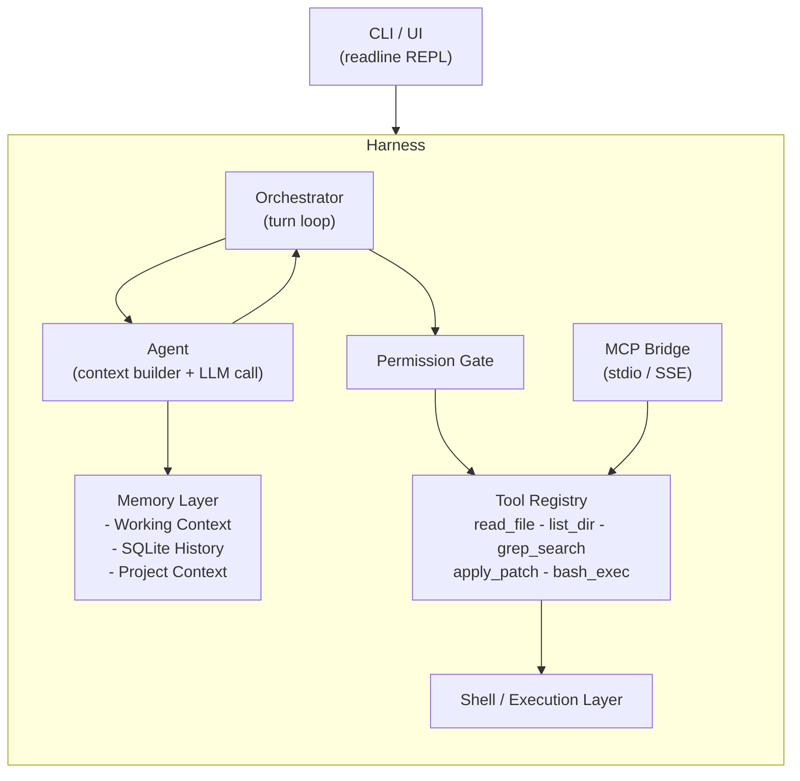
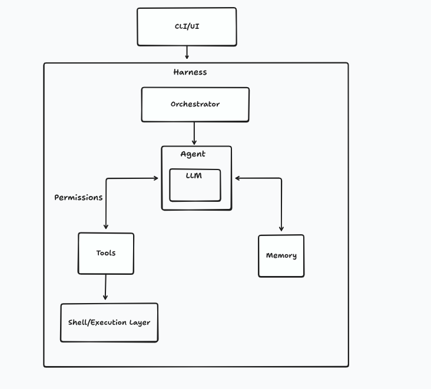

<div align="center">

# Viridian

**A fast, local-first agentic coding assistant for the terminal -- built in Go.**

[](https://go.dev)
[](LICENSE)
[]()

</div>

---

Viridian (`vd`) is a CLI coding assistant that runs entirely on your machine using local LLMs via [Ollama](https://ollama.ai). It can read your codebase, apply diffs, run shell commands, and iterate -- all from your terminal, with no cloud required.

```
$ vd "refactor the auth module to use JWTs instead of sessions"

  - Reading src/auth/session.go ...
  - Searching for session references ...
  - Applying patch to src/auth/auth.go ...
        - Done -- 3 files changed
```

---

## Architecture

The design follows a clean layered architecture inspired by how modern AI coding agents work:



<details>
<summary>Original concept sketch</summary>



</details>

### How a turn works

```
User types a message
        |
        v
Orchestrator adds it to Working Context
        |
        v
Agent assembles prompt:
  - System prompt (who Viridian is, project info)
  - Git context (branch, recent commits)
  - Conversation history
  - Tool schemas (JSON)
        |
        v
OllamaProvider streams response
        |
   +-------------------------+
   | tool_calls?             | plain text?
   v                         v
Permission Gate          Show to user
   |                     (done)
   v
Tool executes
(result added to context)
   |
   +------> back to Agent (loop continues)
```

### Module Layout

```
viridian/
├── cmd/vd/        -> Binary entry point. REPL, arg parsing, output rendering
├── internal/core/ -> Harness, Orchestrator, Agent, Config, Error types
├── internal/llm/  -> Provider interface + Ollama implementation
├── internal/tools/-> Tool interface, Permission system, tool implementations
├── internal/memory/ -> Working context, SQLite history, project context
└── internal/mcp/  -> Model Context Protocol client (JSON-RPC over stdio/SSE)
```

---

## Features

- **Local-first** -- runs entirely on your machine via Ollama, no API keys needed
- **Streaming output** -- see the LLM response token by token as it generates
- **Agentic tool use** -- reads files, searches code, applies diffs, runs shell commands
- **Unified diff editing** -- LLM outputs diffs, Viridian applies them (like Aider)
- **Permission system** -- prompts before any write or shell execution; `--auto-approve` to skip
- **MCP support** -- connect any [Model Context Protocol](https://modelcontextprotocol.io) server as a tool source
- **Conversation history** -- sessions stored in SQLite, resumable across restarts
- **Project awareness** -- git branch, recent commits, and file tree injected into every prompt

---

## Installation

**Prerequisites:** [Go](https://go.dev) 1.22+ and [Ollama](https://ollama.ai)

```bash
# Clone the repo
git clone https://github.com/samayk27/viridian
cd viridian

# Pull a model (qwen2.5-coder recommended for coding tasks)
ollama pull qwen2.5-coder:7b

# Build and install
go install ./cmd/vd
```

---

## Usage

```bash
# Interactive REPL
vd

# One-shot mode
vd "explain what cmd/vd/main.go does"

# Skip permission prompts (auto-approve all tool calls)
vd --auto-approve

# Use a specific model
vd --model qwen2.5-coder:32b

# Browse conversation history
vd history

# Undo the last file change
vd undo
```

---

## Configuration

Config file: `~/.config/viridian/config.toml`

```toml
[llm]
provider = "ollama"
model    = "qwen2.5-coder:7b"
base_url = "http://localhost:11434"

[permissions]
auto_approve_all = false                 # true = same as --auto-approve
auto_approve     = ["ReadFile", "ListDir"]  # safe reads, never prompt

[shell]
timeout_seconds = 30
shell_binary    = "bash"

[memory]
db_path              = "~/.local/share/viridian/history.db"
context_window_chars = 200000
auto_compact         = true

# Optional: connect MCP servers for extra tools
[[mcp.servers]]
name      = "filesystem"
transport = "stdio"
command   = "npx"
args      = ["-y", "@modelcontextprotocol/server-filesystem", "."]
enabled   = false
```

---

## Tools

| Tool          | Description                                 | Requires Approval |
| ------------- | ------------------------------------------- | :---------------: |
| `read_file`   | Read file contents with optional line range |        No         |
| `list_dir`    | List directory contents                     |        No         |
| `grep_search` | ripgrep-powered code search                 |        No         |
| `apply_patch` | Apply unified diff to a file                |       Yes         |
| `write_file`  | Overwrite a file entirely                   |       Yes         |
| `bash_exec`   | Run a shell command, stream output          |       Yes         |

Plus any tools from connected MCP servers.

---

## MCP Support

Viridian implements the [Model Context Protocol](https://modelcontextprotocol.io), letting you connect external tool servers:

```toml
[[mcp.servers]]
name      = "github"
transport = "stdio"
command   = "npx"
args      = ["-y", "@modelcontextprotocol/server-github"]
enabled   = true
```

MCP tools are discovered at startup and appear to the LLM alongside native tools — no special handling needed.

---

## Development

```bash
# Build
go build ./cmd/vd

# Run with logging
VIRIDIAN_LOG=debug go run ./cmd/vd

# Lint
go vet ./...

# Test
go test ./...
```

### Module responsibilities at a glance

| Module            | Owns                                                             |
| ----------------- | ---------------------------------------------------------------- |
| `cmd/vd`          | User interaction, REPL loop, output rendering                    |
| `internal/core`   | Orchestrator turn loop, agent, harness, config                   |
| `internal/llm`    | Provider interface, Ollama HTTP streaming, message types         |
| `internal/tools`  | Tool interface, permission gate, tool implementations            |
| `internal/memory` | Conversation window, SQLite persistence, project context builder |
| `internal/mcp`    | JSON-RPC client, MCP server process management, tool bridge      |

---

## License

MIT
